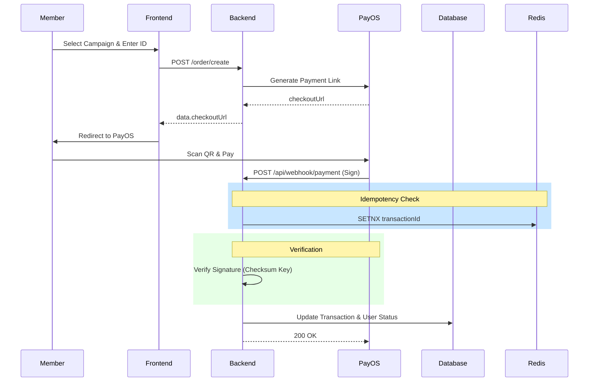

# Architecture Overview

## 1. System Components
- **Frontend:** React + Vite (ClubSphere Dashboard).
- **Backend:** Spring Boot 3.x (Java 17).
- **Database:** MySQL 8 (Permanent storage for Users, Campaigns, Transactions).
- **Cache/Idempotency:** Redis (Ensuring webhooks are not processed twice).
- **Payment Gateway:** PayOS (QR-based banking integration).

## 2. High-Level Flow

## 3. Deployment
- **Docker:** Multi-container setup (Backend, Frontend, MySQL, Redis).
- **Environment Variables:** Used for sensitive keys (DB passwords, PayOS keys).
